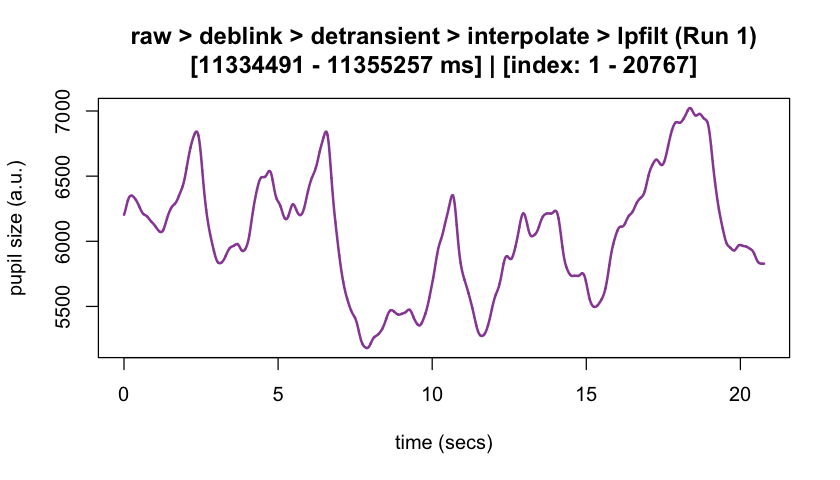
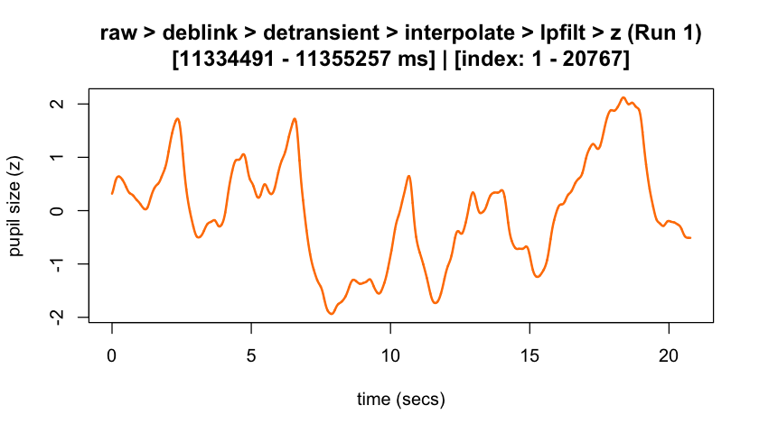
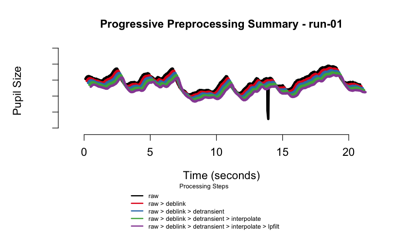
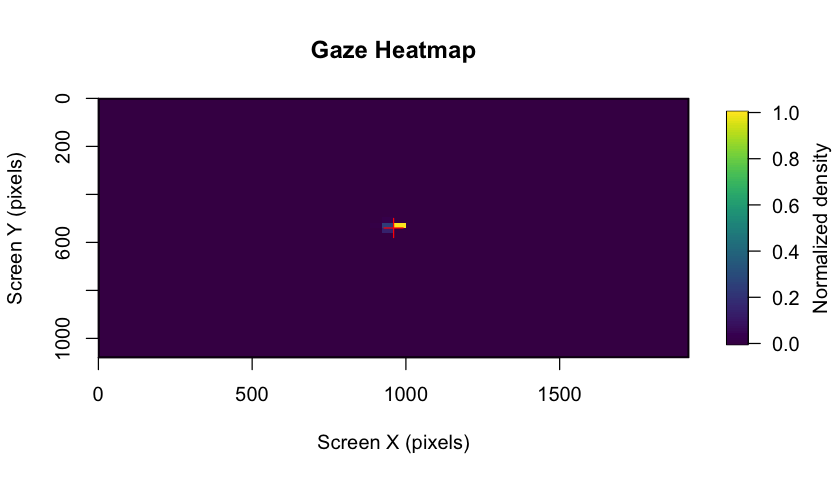

<!-- README.md is generated from README.Rmd-->

# `eyeris`: Flexible, Extensible, & Reproducible Pupillometry Preprocessing <a href="https://shawnschwartz.com/eyeris/" title="eyeris website"></a>

<!-- badges: start -->

[](https://CRAN.R-project.org/package=eyeris)
[](https://cran.r-project.org/package=badger)
[](https://doi.org/10.1101/2025.06.01.657312)
[](https://lifecycle.r-lib.org/articles/stages.html#stable)
[](https://github.com/shawntz/eyeris/actions/workflows/build.yml)
[](https://github.com/shawntz/eyeris/actions/workflows/format-check.yaml)
[](https://github.com/shawntz/eyeris/actions/workflows/pkgdown.yml)
<!-- badges: end -->

<div class="alert alert-light">

<h2>

💻 eyeris DevOps Dashboard
</h2>

Dive deeper into <code>eyeris’</code> development and operational
insights with our new
<a href="https://shawnschwartz.notion.site/eyeris-devops" target="_blank">eyeris
DevOps Dashboard</a>!

</div>

<!-- The goal of eyeris is to ... -->

## 💡 Motivation

Despite decades of pupillometry research, many established packages and
workflows unfortunately lack design principles based on (F)indability
(A)ccessbility (I)nteroperability (R)eusability (FAIR) principles.
`eyeris`, on the other hand follows a thoughtful design philosophy that
results in an intuitive, modular, performant, and extensible
pupillometry data preprocessing framework. Much of these design
principles were heavily inspired by `Nipype`.

`eyeris` also provides a highly opinionated pipeline for tonic and
phasic pupillometry preprocessing (inspired by `fMRIPrep`). These
opinions are the product of many hours of discussions from core members
and signal processing experts from the Stanford Memory Lab (Shawn
Schwartz, Mingjian He, Haopei Yang, Alice Xue, and Anthony Wagner).

`eyeris` also introduces a `BIDS`-like structure for organizing
derivative (preprocessed) pupillometry data, as well as an intuitive
workflow for inspecting preprocessed pupillometry epochs within
beautiful, interactive HTML report files (see demonstration below ⬇️)!
The package also includes gaze heatmaps that show the distribution of
eye coordinates across the entire screen area, helping you assess data
quality and participant attention patterns. These heatmaps are
automatically generated in the BIDS reports and can also be created
manually.

## 🚀 Feature Highlights

- `📦 Modular Design`: Each preprocessing step is a standalone function
  that can be used independently or combined into custom pipelines.
- `🔍 Interactive Reports`: Beautiful, interactive HTML reports that
  summarize preprocessing steps and visualize data quality.
- `🔄 Flexible Extensions`: Easily create custom extensions to the
  preprocessing pipeline by writing your own functions and adding them
  to the pipeline.
- `📊 Data Quality Assessment`: Automatically generated figures of each
  preprocessing step and its effect on the pupil signal (at the global
  and trial levels), as well as gaze heatmaps and binocular correlation
  plots to assess data quality and participant attention patterns.
- `🗂️ BIDS-like File Structure`: Organizes preprocessed data using a
  BIDS-like directory structure that supports both monocular and
  binocular eye-tracking data.
- `📝 Logging Commands`: Automatically capture all console output and
  errors to timestamped log files.


## 📖 Function Reference

Below is a table of all main `eyeris` functions, organized by feature,
with links to their documentation and a brief description.

| **Feature** | **Function Documentation** | **Description** |
|----|----|----|
| **Pipeline Orchestration** | [glassbox()](https://shawnschwartz.com/eyeris/reference/glassbox.html) | Run the full recommended preprocessing pipeline with a single function call. |
| **BIDSify** | [bidsify()](https://shawnschwartz.com/eyeris/reference/bidsify.html) | Create a BIDS-like directory structure for preprocessed data as well as interactive HTML reports for data and signal processing provenance. |
| **Data Loading** | [load_asc()](https://shawnschwartz.com/eyeris/reference/load_asc.html) | Load EyeLink `.asc` files into an `eyeris` object. |
| **Blink Artifact Removal** | [deblink()](https://shawnschwartz.com/eyeris/reference/deblink.html) | Remove blink artifacts by extending and masking missing samples. |
| **Transient (Speed-Based) Artifact Removal** | [detransient()](https://shawnschwartz.com/eyeris/reference/detransient.html) | Remove transient spikes in the pupil signal using a moving MAD filter. |
| **Linear Interpolation** | [interpolate()](https://shawnschwartz.com/eyeris/reference/interpolate.html) | Interpolate missing (NA) samples in the pupil signal. |
| **Lowpass Filtering** | [lpfilt()](https://shawnschwartz.com/eyeris/reference/lpfilt.html) | Apply a Butterworth lowpass filter to the pupil signal. |
| **Downsampling** | [downsample()](https://shawnschwartz.com/eyeris/reference/downsample.html) | Downsample the pupil signal to a lower sampling rate. |
| **Binning** | [bin()](https://shawnschwartz.com/eyeris/reference/bin.html) | Bin pupil data into specified time bins using mean or median. |
| **Detrending** | [detrend()](https://shawnschwartz.com/eyeris/reference/detrend.html) | Remove slow drifts from the pupil signal by linear detrending. |
| **Z-scoring** | [zscore()](https://shawnschwartz.com/eyeris/reference/zscore.html) | Z-score the pupil signal within each block. |
| **Confound Summary** | [summarize_confounds()](https://shawnschwartz.com/eyeris/reference/summarize_confounds.html) | Summarize and visualize confounding variables for each preprocessing step. |
| **Epoching & Baselining** | [epoch()](https://shawnschwartz.com/eyeris/reference/epoch.html) | Extract time-locked epochs from the continuous pupil signal. |
| **Plotting** | [plot()](https://shawnschwartz.com/eyeris/reference/plot.eyeris.html) | Plot the pupil signal and preprocessing steps. |
| **Gaze Heatmaps** | [plot_gaze_heatmap()](https://shawnschwartz.com/eyeris/reference/plot_gaze_heatmap.html) | Generate heatmaps of gaze position across the screen. |
| **Binocular Correlation** | [plot_binocular_correlation()](https://shawnschwartz.com/eyeris/reference/plot_binocular_correlation.html) | Compute correlation between left and right eye pupil signals. |
| **Demo (Monocular) Dataset** | [eyelink_asc_demo_dataset()](https://shawnschwartz.com/eyeris/reference/eyelink_asc_demo_dataset.html) | Load a demo monocular recording EyeLink dataset for testing and examples. |
| **Demo (Binocular) Dataset** | [eyelink_asc_binocular_demo_dataset()](https://shawnschwartz.com/eyeris/reference/eyelink_asc_binocular_demo_dataset.html) | Load a demo binocular recording EyeLink dataset for testing and examples. |
| **Logging Commands** | [eyelogger()](https://shawnschwartz.com/eyeris/reference/eyelogger.html) | Automatically capture all console output and errors to timestamped log files. |
| **Custom Extensions** | *See vignette: [Custom Extensions](https://shawnschwartz.com/eyeris/articles/custom-extensions.html)* | Learn how to write your own pipeline steps and integrate them with `eyeris`. |

> For a full list of all functions, see the [eyeris reference
> index](https://shawnschwartz.com/eyeris/reference/index.html).

## 📚 Tutorials

### 🌟 Start Here

- [✈️ Getting Started: Complete (Opinionated) Pupillometry Pipeline
  Walkthrough](https://shawnschwartz.com/eyeris/articles/complete-pipeline.html)
- [📁 Extracting Data Epochs and Exporting Pupil
  Data](https://shawnschwartz.com/eyeris/articles/epoching-bids-reports.html)

### 👀 Pupil Data Quality Control

- [🔎 QC with Interactive
  Reports](https://shawnschwartz.com/eyeris/articles/reports.html)

### 💯 Advanced Topics

- [🫀 Anatomy of an `eyeris`
  Object](https://shawnschwartz.com/eyeris/articles/anatomy.html)
- [🛠️ Building Your Own Custom Pipeline
  Extensions](https://shawnschwartz.com/eyeris/articles/custom-extensions.html)

## 📦 Package Installation

### Stable release from CRAN

You can install the stable release of [`eyeris` from
CRAN](https://cran.r-project.org/package=eyeris) with:

``` r
install.packages("eyeris")
```

or

``` r
# install.packages("pak")
pak::pak("eyeris")
```

### Development version from GitHub

You can install the development version of [`eyeris` from
GitHub](https://github.com/shawntz/eyeris) with:

``` r
# install.packages("devtools")
devtools::install_github("shawntz/eyeris", ref = "dev")
```

## ✏️ Example

### The `glassbox()` “prescription” function

This is a basic example of how to use `eyeris` out of the box with our
very *opinionated* set of steps and parameters that one should start out
with when preprocessing pupillometry data. Critically, this is a
“glassbox” – as opposed to a “blackbox” – since each step and parameter
implemented herein is fully open and accessible to you. We designed each
pipeline step / function to be like legos – they are intentionally and
carefully designed in a way that allows you to flexibly construct and
compare different pipelines.

We hope you enjoy! -shawn

``` r
set.seed(32)

library(eyeris)
#> 
#> eyeris v2.1.0 - Lumpy Space Princess ꒰•ᴗ•｡꒱۶
#> Welcome! Type ?`eyeris` to get started.

demo_data <- eyelink_asc_demo_dataset()

eyeris_preproc <- glassbox(
  demo_data,
  lpfilt = list(plot_freqz = FALSE)
)
#> ✔ [OKAY] Running eyeris::load_asc()
#> ℹ [INFO] Processing block: block_1
#> ✔ [OKAY] Running eyeris::deblink() for block_1
#> ✔ [OKAY] Running eyeris::detransient() for block_1
#> ✔ [OKAY] Running eyeris::interpolate() for block_1
#> ✔ [OKAY] Running eyeris::lpfilt() for block_1
#> ! [WARN] Skipping eyeris::downsample() for block_1
#> ! [WARN] Skipping eyeris::bin() for block_1
#> ! [WARN] Skipping eyeris::detrend() for block_1
#> ✔ [OKAY] Running eyeris::zscore() for block_1
#> ℹ [INFO] Block processing summary:
#> ℹ [INFO] block_1: OK (steps: 6, latest: pupil_raw_deblink_detransient_interpolate_lpfilt_z)
#> ✔ [OKAY] Running eyeris::summarize_confounds()
```

### Step-wise correction of pupillary signal

``` r
plot(eyeris_preproc, add_progressive_summary = TRUE)
```

<div style="display: flex; justify-content: center; gap: 20px;">


</div>

### Final pre-post correction of pupillary signal (raw ➡ preprocessed)

``` r
start_time <- min(eyeris_preproc$timeseries$block_1$time_secs)
end_time <- max(eyeris_preproc$timeseries$block_1$time_secs)

plot(eyeris_preproc,
  # steps = c(1, 5), # uncomment to specify a subset of preprocessing steps to plot; by default, all steps will plot in the order in which they were executed by eyeris
  preview_window = c(start_time, end_time),
  add_progressive_summary = TRUE
)
#> ℹ [INFO] Plotting block 1 from possible blocks: 1
#> ℹ [INFO] Plotting with sampling rate: 1000 Hz
```



    #> ℹ [INFO] Creating progressive summary plot for block_1



    #> ✔ [OKAY] Progressive summary plot created successfully!

    plot_gaze_heatmap(
      eyeris = eyeris_preproc,
      block = 1
    )



## BIDS-like file structure

`eyeris` organizes preprocessed data using a BIDS-like directory
structure that supports both monocular and binocular eye-tracking data.
The `bidsify()` function creates a standardized directory hierarchy with
separate organization for different data types.

### Monocular data structure

For single-eye recordings, data are organized in the main eye directory:

    bids_dir/
    └── derivatives/
        └── sub-001/
            └── ses-01/
                ├── sub-001.html
                └── eye/
                    ├── sub-001_ses-01_task-test_run-01_desc-timeseries_eye.csv
                    ├── sub-001_ses-01_task-test_run-01_desc-confounds.csv
                    ├── sub-001_ses-01_task-test_run-01_epoch-stimulus_desc-preproc_pupil.csv
                    ├── sub-001_ses-01_task-test_run-01_baseline-stimulus_desc-preproc_pupil.csv
                    ├── sub-001_ses-01_task-test_run-01_events.csv
                    ├── sub-001_ses-01_task-test_run-01_blinks.csv
                    ├── sub-001_ses-01_task-test_run-01_summary.csv
                    ├── sub-001_ses-01_task-test_run-01.html
                    └── source/
                        ├── figures/
                        │   └── run-01/
                        │       ├── run-01_fig-1_deblink.jpg
                        │       ├── run-01_fig-2_detrend.jpg
                        │       ├── run-01_fig-3_interpolate.jpg
                        │       ├── run-01_fig-4_lpfilt.jpg
                        │       ├── run-01_fig-5_zscore.jpg
                        │       ├── run-01_gaze_heatmap.png
                        │       ├── run-01_detrend.png
                        │       └── run-01_desc-progressive_summary.png
                        └── logs/
                            └── run-01_metadata.json

### Binocular data structure

For binocular recordings, data are organized into separate `left` and
`right` eye subdirectories:

    bids_dir/
    └── derivatives/
        └── sub-001/
            └── ses-01/
                ├── sub-001-L.html
                ├── sub-001-R.html
                ├── eye-L/
                │   ├── sub-001_ses-01_task-test_run-01_desc-timeseries_eye-L.csv
                │   ├── sub-001_ses-01_task-test_run-01_desc-confounds_eye-L.csv
                │   ├── sub-001_ses-01_task-test_run-01_epoch-stimulus_desc-preproc_pupil_eye-L.csv
                │   ├── sub-001_ses-01_task-test_run-01_baseline-stimulus_desc-preproc_pupil_eye-L.csv
                │   ├── sub-001_ses-01_task-test_run-01_events_eye-L.csv
                │   ├── sub-001_ses-01_task-test_run-01_blinks_eye-L.csv
                │   ├── sub-001_ses-01_task-test_run-01_summary_eye-L.csv
                │   ├── sub-001_ses-01_task-test_run-01_eye-L.html
                │   └── source/
                │       ├── figures/
                │       │   └── run-01/
                │       └── logs/
                │           └── run-01_metadata.json
                └── eye-R/
                    ├── sub-001_ses-01_task-test_run-01_desc-timeseries_eye-R.csv
                    ├── sub-001_ses-01_task-test_run-01_desc-confounds_eye-R.csv
                    ├── sub-001_ses-01_task-test_run-01_epoch-stimulus_desc-preproc_pupil_eye-R.csv
                    ├── sub-001_ses-01_task-test_run-01_baseline-stimulus_desc-preproc_pupil_eye-R.csv
                    ├── sub-001_ses-01_task-test_run-01_events_eye-R.csv
                    ├── sub-001_ses-01_task-test_run-01_blinks_eye-R.csv
                    ├── sub-001_ses-01_task-test_run-01_summary_eye-R.csv
                    ├── sub-001_ses-01_task-test_run-01_eye-R.html
                    └── source/
                        ├── figures/
                        │   └── run-01/
                        └── logs/
                            └── run-01_metadata.json

### File naming convention

All files follow a consistent BIDS-like naming pattern:

- **Timeseries data**: `desc-timeseries_eye` (with `_eye-L` or `_eye-R`
  suffix for binocular data)
- **Confounds**: `desc-confounds` (with eye suffix for binocular data)
- **Epochs**: `epoch-{event}_desc-preproc_pupil` (with eye suffix for
  binocular data)
- **Baselines**: `baseline-{event}_desc-preproc_pupil` (with eye suffix
  for binocular data)
- **Events**: `events` (with eye suffix for binocular data)
- **Blinks**: `blinks` (with eye suffix for binocular data)
- **Reports**: HTML files with eye suffix for binocular data

### Events and blinks data

The events and blinks CSV files contain the raw event markers and blink
detection data as stored in the eyeris object:

**Events file structure:**

- `block`: Block/run number
- `time`: Timestamp of the event
- `text`: Raw event text from the ASC file
- `text_unique`: Unique event identifier

**Blinks file structure:**

- `block`: Block/run number
- `stime`: Start time of the blink
- `etime`: End time of the blink
- `dur`: Duration of the blink in milliseconds
- `eye`: Eye identifier (L/R for binocular data)

### Key features

- **Organized Structure**: Clear separation between monocular and
  binocular data
- **Consistent Naming**: Standardized file naming across all data types
- **Complete Documentation**: HTML reports with preprocessing summaries
  and visualizations
- **Quality Assessment**: Gaze heatmaps and binocular correlation plots
  for data quality evaluation
- **Reproducibility**: Metadata files documenting preprocessing
  parameters and call stacks

## Logging `eyeris` commands with `eyelogger()`

## 📁 BIDS-like file structure

`eyeris` organizes preprocessed data using a BIDS-like directory
structure that supports both monocular and binocular eye-tracking data.
The `bidsify()` function creates a standardized directory hierarchy with
separate organization for different data types.

### Monocular data structure

For single-eye recordings, data are organized in the main eye directory:

    bids_dir/
    └── derivatives/
        └── sub-001/
            └── ses-01/
                ├── sub-001.html
                └── eye/
                    ├── sub-001_ses-01_task-test_run-01_desc-timeseries_eye.csv
                    ├── sub-001_ses-01_task-test_run-01_desc-confounds.csv
                    ├── sub-001_ses-01_task-test_run-01_epoch-stimulus_desc-preproc_pupil.csv
                    ├── sub-001_ses-01_task-test_run-01_baseline-stimulus_desc-preproc_pupil.csv
                    ├── sub-001_ses-01_task-test_run-01_events.csv
                    ├── sub-001_ses-01_task-test_run-01_blinks.csv
                    ├── sub-001_ses-01_task-test_run-01_summary.csv
                    ├── sub-001_ses-01_task-test_run-01.html
                    └── source/
                        ├── figures/
                        │   └── run-01/
                        │       ├── run-01_fig-1_deblink.jpg
                        │       ├── run-01_fig-2_detrend.jpg
                        │       ├── run-01_fig-3_interpolate.jpg
                        │       ├── run-01_fig-4_lpfilt.jpg
                        │       ├── run-01_fig-5_zscore.jpg
                        │       ├── run-01_gaze_heatmap.png
                        │       ├── run-01_detrend.png
                        │       └── run-01_desc-progressive_summary.png
                        └── logs/
                            └── run-01_metadata.json

### Binocular data structure

For binocular recordings, data are organized into separate `left` and
`right` eye subdirectories:

    bids_dir/
    └── derivatives/
        └── sub-001/
            └── ses-01/
                ├── sub-001-L.html
                ├── sub-001-R.html
                ├── eye-L/
                │   ├── sub-001_ses-01_task-test_run-01_desc-timeseries_eye-L.csv
                │   ├── sub-001_ses-01_task-test_run-01_desc-confounds_eye-L.csv
                │   ├── sub-001_ses-01_task-test_run-01_epoch-stimulus_desc-preproc_pupil_eye-L.csv
                │   ├── sub-001_ses-01_task-test_run-01_baseline-stimulus_desc-preproc_pupil_eye-L.csv
                │   ├── sub-001_ses-01_task-test_run-01_events_eye-L.csv
                │   ├── sub-001_ses-01_task-test_run-01_blinks_eye-L.csv
                │   ├── sub-001_ses-01_task-test_run-01_summary_eye-L.csv
                │   ├── sub-001_ses-01_task-test_run-01_eye-L.html
                │   └── source/
                │       ├── figures/
                │       │   └── run-01/
                │       └── logs/
                │           └── run-01_metadata.json
                └── eye-R/
                    ├── sub-001_ses-01_task-test_run-01_desc-timeseries_eye-R.csv
                    ├── sub-001_ses-01_task-test_run-01_desc-confounds_eye-R.csv
                    ├── sub-001_ses-01_task-test_run-01_epoch-stimulus_desc-preproc_pupil_eye-R.csv
                    ├── sub-001_ses-01_task-test_run-01_baseline-stimulus_desc-preproc_pupil_eye-R.csv
                    ├── sub-001_ses-01_task-test_run-01_events_eye-R.csv
                    ├── sub-001_ses-01_task-test_run-01_blinks_eye-R.csv
                    ├── sub-001_ses-01_task-test_run-01_summary_eye-R.csv
                    ├── sub-001_ses-01_task-test_run-01_eye-R.html
                    └── source/
                        ├── figures/
                        │   └── run-01/
                        └── logs/
                            └── run-01_metadata.json

### File naming convention

All files follow a consistent BIDS-like naming pattern:

- **Timeseries data**: `desc-timeseries_eye` (with `_eye-L` or `_eye-R`
  suffix for binocular data)
- **Confounds**: `desc-confounds` (with eye suffix for binocular data)
- **Epochs**: `epoch-{event}_desc-preproc_pupil` (with eye suffix for
  binocular data)
- **Baselines**: `baseline-{event}_desc-preproc_pupil` (with eye suffix
  for binocular data)
- **Events**: `events` (with eye suffix for binocular data)
- **Blinks**: `blinks` (with eye suffix for binocular data)
- **Reports**: HTML files with eye suffix for binocular data

### Events and blinks data

The events and blinks CSV files contain the raw event markers and blink
detection data as stored in the eyeris object:

**Events file structure:**

- `block`: Block/run number
- `time`: Timestamp of the event
- `text`: Raw event text from the ASC file
- `text_unique`: Unique event identifier

**Blinks file structure:**

- `block`: Block/run number
- `stime`: Start time of the blink
- `etime`: End time of the blink
- `dur`: Duration of the blink in milliseconds
- `eye`: Eye identifier (L/R for binocular data)

### Key features

- **Organized Structure**: Clear separation between monocular and
  binocular data
- **Consistent Naming**: Standardized file naming across all data types
- **Complete Documentation**: HTML reports with preprocessing summaries
  and visualizations
- **Quality Assessment**: Gaze heatmaps and binocular correlation plots
  for data quality evaluation
- **Reproducibility**: Metadata files documenting preprocessing
  parameters and call stacks

## 📝 Logging `eyeris` commands with `eyelogger()`

The `eyelogger()` utility lets you run any `eyeris` command (or block of
R code) while automatically capturing all console output and errors to
timestamped log files. This is especially useful for reproducibility,
debugging, or running batch jobs.

**How it works:**

- All standard output (`stdout`) and standard error (`stderr`) are saved
  to log files in a directory you specify (or a temporary directory by
  default).
- Each run produces two log files:
  - `<timestamp>.out`: all console output
  - `<timestamp>.err`: all warnings and errors

### Usage

You can wrap any `eyeris` command or block of code in
`eyelogger({ ... })`:

``` r
library(eyeris)

# log a simple code block with messages, warnings, and prints
eyelogger({
  message("eyeris `glassbox()` completed successfully.")
  warning("eyeris `glassbox()` completed with warnings.")
  print("some eyeris-related information.")
})

# log a real eyeris pipeline run, saving logs to a custom directory
log_dir <- file.path(tempdir(), "eyeris_logs")
eyelogger({
  glassbox(eyelink_asc_demo_dataset(), interactive_preview = FALSE)
}, log_dir = log_dir)
```

### Parameters

- `eyeris_cmd`: The code to run (wrap in `{}` for multiple lines).
- `log_dir`: Directory to save logs (default: a temporary directory).
- `timestamp_format`: Format for log file names (default:
  `"%Y%m%d_%H%M%S"`).

### What you get

After running, you’ll find log files in your specified directory, e.g.:

    20240614_153012.out   # console output
    20240614_153012.err   # warnings and errors

This makes it easy to keep a record of your preprocessing runs and debug
any issues that arise.

------------------------------------------------------------------------

## :see_no_evil: `eyeris` dependency graph


------------------------------------------------------------------------

## 🤝 Contributing to `eyeris`

Thank you for considering contributing to the open-source `eyeris` R
package; there are many ways one could contribute to `eyeris`.

We believe the best preprocessing practices emerge from collective
expertise and rigorous discussion. Please see the [contribution
guidelines](https://shawnschwartz.com/eyeris/CONTRIBUTING.html) for more
information on how to get started..

## 📜 Code of Conduct

Please note that the eyeris project is released with a [Contributor Code
of Conduct](https://shawnschwartz.com/eyeris/CODE_OF_CONDUCT.html). By
contributing to this project, you agree to abide by its terms.

## 💬 Suggestions, questions, issues?

Please use the issues tab (<https://github.com/shawntz/eyeris/issues>)
to make note of any bugs, comments, suggestions, feedback, etc… all are
welcomed and appreciated, thanks!

## 📚 Citing `eyeris`

<div class="alert alert-light" style="padding-bottom: 0;">

If you use the `eyeris` package in your research, please consider citing
our preprint!

Run the following in R to get the citation:

</div>

``` r
citation("eyeris")
#> To cite package 'eyeris' in publications use:
#> 
#>   Schwartz ST, Yang H, Xue AM, He M (2025). "eyeris: A flexible,
#>   extensible, and reproducible pupillometry preprocessing framework in
#>   R." _bioRxiv_, 1-37. doi:10.1101/2025.06.01.657312
#>   <https://doi.org/10.1101/2025.06.01.657312>.
#> 
#> A BibTeX entry for LaTeX users is
#> 
#>   @Article{,
#>     title = {eyeris: A flexible, extensible, and reproducible pupillometry preprocessing framework in R},
#>     author = {Shawn T Schwartz and Haopei Yang and Alice M Xue and Mingjian He},
#>     journal = {bioRxiv},
#>     year = {2025},
#>     pages = {1--37},
#>     doi = {10.1101/2025.06.01.657312},
#>   }
```
