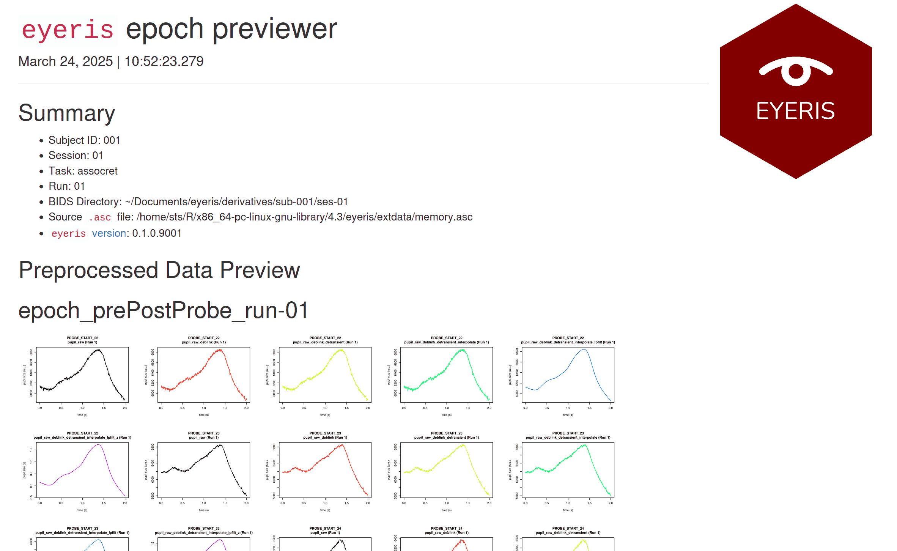
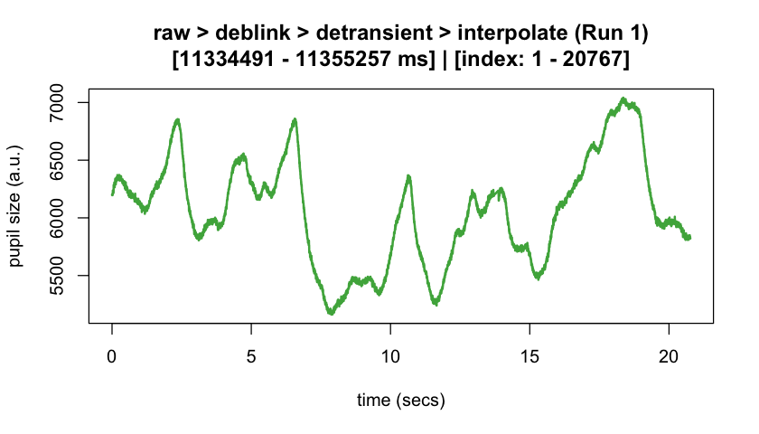

<!-- README.md is generated from README.Rmd-->

# `eyeris`: A Flexible, Extensible, and Reproducible Pupillometry Preprocessing Framework in R <a href="http://shawnschwartz.com/eyeris/" title="eyeris website"></a>

<!-- badges: start -->

<a href="https://github.com/shawntz/eyeris/blob/dev/LICENSE.md" alt="MIT License"></a>
<a href="https://github.com/shawntz/eyeris/actions/workflows/build.yml/badge.svg" alt="R Package Build Status"></a>
<a href="https://github.com/shawntz/eyeris/actions/workflows/linter.yml/badge.svg" alt="R Package Linter Status"></a>
<!-- badges: end -->

<!-- The goal of eyeris is to ... -->

## Motivation

Despite decades of pupillometry research, many established packages and
workflows unfortunately lack design principles based on (F)indability
(A)ccessbility (I)nteroperability (R)eusability (FAIR) principles.
`eyeris`, on the other hand follows a thoughtful design philosophy that
results in an intuitive, modular, performant, and extensible
pupillometry data preprocessing framework. Much of these design
principles were heavily inspired by `Nipype`.

`eyeris` also provides a highly opinionated pipeline for tonic and
phasic pupillometry preprocessing (inspired by `fMRIPrep`). These
opinions are the product of many hours of discussions from core members
and signal processing experts from the Stanford Memory Lab (Shawn
Schwartz, Mingjian He, Haopei Yang, Alice Xue, and Anthony Wagner).

`eyeris` also introduces a `BIDS`-like structure for organizing
derivative (preprocessed) pupillometry data, as well as an intuitive
workflow for inspecting preprocessed pupillometry epochs within
beautiful, interactive HTML report files (see demonstration below ⬇️)!



## Installation

You can install the development version of eyeris from
[GitHub](https://github.com/) with:

``` r
# install.packages("devtools")
devtools::install_github("shawntz/eyeris")
```

or

``` r
# install.packages("pak")
pak::pak("shawntz/eyeris")
```

## Example

### the `glassbox()` “prescription” function

This is a basic example of how to use `eyeris` out of the box with our
very *opinionated* set of steps and parameters that one should start out
with when preprocessing pupillometry data. Critically, this is a
“glassbox” – as opposed to a “blackbox” – since each step and parameter
implemented herein is fully open and accessible to you. We designed each
pipeline step / function to be like legos – they are intentionally and
carefully designed in a way that allows you to flexibly construct and
compare different pipelines.

We hope you enjoy! -shawn

``` r
set.seed(32)

library(eyeris)

demo_data <- system.file("extdata", "memory.asc", package = "eyeris")

eyeris_preproc <- glassbox(
  demo_data,
  detrend_data = F,
  lpfilt = list(plot_freqz = T)
)
#> ✔ [  OK  ] - Running eyeris::load_asc()
#> ✔ [  OK  ] - Running eyeris::deblink()
#> ✔ [  OK  ] - Running eyeris::detransient()
#> ✔ [  OK  ] - Running eyeris::interpolate()
#> ✔ [  OK  ] - Running eyeris::lpfilt()
#> ✔ [  OK  ] - Skipping eyeris::detrend()
#> ✔ [  OK  ] - Running eyeris::zscore()
```

### step-wise correction of pupillary signal

``` r
plot(eyeris_preproc)
#> ! Plotting block 1 from possible blocks: 1
```

<div style="display: flex; justify-content: center; gap: 20px;">


</div>

### final pre-post correction of pupillary signal (raw ➡ preprocessed)

``` r
plot(eyeris_preproc,
  steps = c(1, 5),
  preview_window = c(0, nrow(eyeris_preproc$timeseries$block_1))
)
#> ! Plotting block 1 from possible blocks: 1
```



------------------------------------------------------------------------

## `eyeris` dependency graph :see_no_evil:


------------------------------------------------------------------------

# Suggestions, questions, issues?

Please use the issues tab (<https://github.com/shawntz/eyeris/issues>)
to make note of any bugs, comments, suggestions, feedback, etc… all are
welcomed and appreciated, thanks!

# Code of Conduct

Please note that the eyeris project is released with a [Contributor Code
of Conduct](https://shawnschwartz.com/eyeris/CODE_OF_CONDUCT.html). By
contributing to this project, you agree to abide by its terms.

------------------------------------------------------------------------

### 📚 Citing `eyeris`

<div class="alert alert-light">

If you use the `eyeris` package in your research, please cite it!

Run the following in R to get the citation:

</div>

``` r
citation("eyeris")
#> To cite package 'eyeris' in publications use:
#> 
#>   Schwartz S (2025). _eyeris: Flexible, Extensible, & Reproducible
#>   Processing of Pupil Data_. R package version 1.0.0,
#>   https://github.com/shawntz/eyeris/,
#>   <https://shawnschwartz.com/eyeris/>.
#> 
#> A BibTeX entry for LaTeX users is
#> 
#>   @Manual{,
#>     title = {eyeris: Flexible, Extensible, & Reproducible Processing of Pupil Data},
#>     author = {Shawn Schwartz},
#>     year = {2025},
#>     note = {R package version 1.0.0, https://github.com/shawntz/eyeris/},
#>     url = {https://shawnschwartz.com/eyeris/},
#>   }
```
