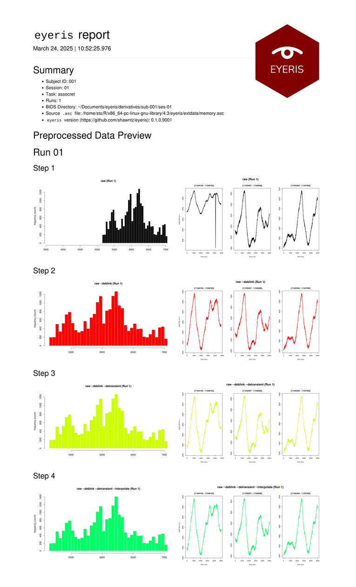

```{r, include = FALSE}
knitr::opts_chunk$set(
  collapse = TRUE,
  comment = "#>",
  fig.dpi = 300
)
```

## 1️⃣ Setup

After extracting epochs from your data,

```{r eval=FALSE}
eye <- eye |>
  epoch(
    events = "PROBE_START_{trial}",
    limits = c(0, 1),
    label = "probeEpochs",
    calc_baseline = TRUE,
    apply_baseline = TRUE,
    baseline_type = "sub",
    baseline_events = "DELAY_STOP_*",
    baseline_period = c(-1, 0)
  )
```
(for more details on extracting pupil data epochs, see the [Extracting Data Epochs and Exporting Pupil Data vignette](epoching-bids-reports.html); for more details on this specific example code shown above, [click here](epoching-bids-reports.html#example-c-epoch-with-subtractive-baselining)).

## 2️⃣ Generating the Interactive HTML Reports

When running `bidsify` on the previously epoched data, be sure to set 
`html_report` to `TRUE` (as shown below).

```{r eval=FALSE}
bidsify(
  eyeris = eye_1c,
  bids_dir = tempdir(), # Replace with preferred path, like "~/Documents/eyeris"
  participant_id = "001",
  session_num = "01",
  task_name = "assocmem",
  run_num = "01",
  save_raw = TRUE, # Also save raw timeseries
  html_report = TRUE, # Generate an interactive preproc summary report document
  report_seed = 0 # Make randomly selected plot epochs reproducible across runs
)
```

Which will create a directory structure like this:

```
eyeris
└── derivatives
    └── sub-001
        └── ses-01
            ├── eye
            │   ├── sub-001_ses-01_task-assocret_run-01_desc-timeseries_pupil.csv
            │   └── sub-001_ses-01_task-assocret_run-01_epoch-prePostProbe_desc-preproc_pupil.csv
            ├── source
            │   └── figures
            │       └── run-01
            │           ├── epoch_prePostProbe
            │           │   ├── run-01_PROBE_START_22_1.png
            │           │   ├── run-01_PROBE_START_22_2.png
            │           │   ├── run-01_PROBE_START_22_3.png
            │           │   ├── run-01_PROBE_START_22_4.png
            │           │   ├── run-01_PROBE_START_22_5.png
            │           │   ├── run-01_PROBE_START_22_6.png
            │           │   ├── ...
            │           │   ├── run-01_PROBE_STOP_22_1.png
            │           │   ├── run-01_PROBE_STOP_22_2.png
            │           │   ├── run-01_PROBE_STOP_22_3.png
            │           │   ├── run-01_PROBE_STOP_22_4.png
            │           │   ├── run-01_PROBE_STOP_22_5.png
            │           │   ├── run-01_PROBE_STOP_22_6.png
            │           │   ├── ...
            │           ├── run-01_fig-1_desc-histogram.jpg
            │           ├── run-01_fig-1_desc-timeseries.jpg
            ├── sub-001_epoch-prePostProbe_run-01.html
            └── sub-001.html

9 directories, 80 files
```

Here, notice specifically these two files:

- <highlight>sub-001.html</highlight>
- <highlight>sub-001_epoch-prePostProbe_run-01.html</highlight>

## 3️⃣ Previewing your Entire Pupil Timeseries

> `sub-001.html` will look something like this:

```{r echo=FALSE, out.width='75%'}

```

## 4️⃣ Data QC of Extracted Pupil Epochs with Interactive Reports

> Meanwhile, `sub-001_epoch-prePostProbe_run-01.html` will enable you to
interact with images of each extracted data epoch (for which you will see
include separate images for each epoch at each sequential stage of the
preprocessing pipeline). This feature was intentionally designed to make data
QC a default behavior without the barriers of needing to code up a script with
loops to print out images of each preprocessing step for each epoch for each
participant. 
>
> **As you see below, you can use your left/right arrow keys on**
**your keyboard to quickly scan through the data from each trial, while**
**simultaneously watching what happened to any given epoch's signal from start**
**to finish! We hope this intuitive feature is fun and helps you make more**
**appropriate preprocessing decisions to optimize your signal-to-noise ratio**
**with as little overhead as possible!**

```{r, echo=FALSE, out.width='100%'}
knitr::include_graphics("../man/figures/interactive-reports-demo.gif")
```

---

## 📚 Citing `eyeris`

<div class="alert alert-light" style="margin-top: 1rem; margin-bottom: 1rem; padding-bottom: 0.5rem;">
  If you use the `eyeris` package in your research, please cite it!
  
  Run the following in R to get the citation:
</div>

```{r}
citation("eyeris")
```
